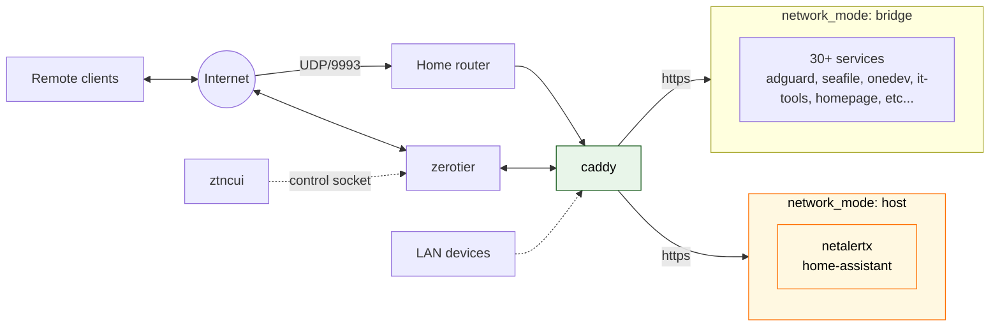

# Home lab

Single-node home lab on a Raspberry Pi 5: one ZeroTier UDP port in, Caddy in front of everything else, ~30 self-hosted services on a bridge network.

## Topology



One open port on the router, one HTTP edge on the Pi, one bridge network for almost everything.
`home-assistant` and `netalertx` are the two exceptions on `network_mode: host`; see [docs/decisions.md](docs/decisions.md) for why.

## Services

| Subdomain | Service | What it is |
|---|---|---|
| `dash.…` | Homepage | Lab dashboard |
| `logs.…` | Dozzle | Lab Live containers logs |
| `status.…` | Uptime Kuma | Lab containers uptime monitoring |
| `home.…` | Home Assistant | Smart home hub |
| `inventory.…` | Homebox | Household inventory |
| `adguard.…` | AdGuard Home | LAN DNS + ad-blocker |
| `nodered.…` | Node-RED | Automation flows |
| `vpn.…` | ZTNCUI | ZeroTier controller UI |
| `netalertx.…` | NetAlertX | LAN device monitor |
| `git.…` | OneDev | Git + CI/CD |
| `tools.…` | IT-Tools | Developer toolbox |
| `phatcrack.…` | Phatcrack | Hash cracking |
| `monitor.…` | Changedetection | Website change monitor |
| `share.…` | Pingvin Share | File sharing |
| `cloud.…` | Seafile | Cloud storage + sync |
| `blog.…` | Ghost | Blog |
| `memos.…` | Memos | Note-taking |
| `archive.…` | ArchiveBox | Web archive |
| `ai.…` | Open WebUI | Chat UI for local LLMs |
| `metube.…` | MeTube | yt-dlp Web UI |
| `books.…` | Calibre-Web | eBook library |
| `manga.…` | Kavita | Manga / comics / eBooks |
| `radarr.…` | Radarr | Movies |
| `music.…` | Navidrome | Music |
| `sonarr.…` | Sonarr | TV shows |
| `jellyfin.…` | Jellyfin | Media server |
| `media.…` | Prowlarr | Indexer aggregator |
| `torrent.…` | qBittorrent | Torrent client |

LAN-only: Minecraft Leaf, RustDesk, Ollama, Watchtower, FlareSolverr, Docker-pruner, and the support databases (Postgres, MariaDB, memcached).

## Run

Copy `.env.example` to `.env` and fill in your real values, then:

```bash
docker compose up -d
```

## Docs

- [`docs/services.md`](docs/services.md) — one section per service, with rationale and rejected alternatives
- [`docs/decisions.md`](docs/decisions.md) — settled decisions
- [`docs/architecture-notes.md`](docs/architecture-notes.md) — topology, long form